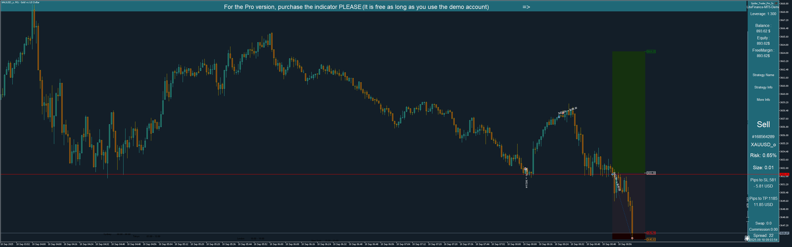

ر# AutoScreenShotOnTrade — ابزار ثبت اسکرین‌شات با هر معامله (MT5)

ابزار/اندیکاتور MQL5 برای گرفتن **اسکرین‌شات خودکار** از چارت هنگام وقوع معاملات (Open / Close / Pending) و اضافه کردن یک پنل اطلاعاتی (اندازه پوزیشن، ریسک، سود/زیان، اسپرد، تاریخ و ...). مناسب برای تهیه ژورنال معاملاتی تصویری یا تهیه گزارش از معاملات.



## ویژگی‌ها (Highlights)
- گرفتن اسکرین‌شات با رزولوشن قابل تنظیم (Dimensions_X, Dimensions_Y).
- رسم پنل اطلاعات شامل: شماره تیکت، نماد، اندازه پوزیشن، ریسک (در درصد)، Pips تا SL/TP، Swap، Commission، Balance/Equity و ...
- نمایش گرافیکی SL/TP/Open/Close روی چارت با رنگ‌ها و برچسب‌های قابل تنظیم.
- پشتیبانی از فرمت PNG و GIF.
- امکان محدودسازی به کاربران خاص (چک لایسنس / حساب دمو).
- امکان ذخیره‌ی چند اسکرین‌شات سریالی برای هر معامله.

---

## نصب
1. پوشه‌ی این پروژه را در `MQL5/Indicators/AutoScreenShotOnTrade/` (یا `MQL5/Experts/` در صورت نیاز) کپی کنید.
2. در متاتریدر، فایل را Compile کنید.
3. اندیکاتور/اکسپرت را روی چارت نماد مورد نظر قرار دهید.
4. تنظیمات ورودی (Inputs) را مطابق نیاز تنظیم کنید.

---

## پارامترهای مهم (Inputs)
- `Dimensions_X`, `Dimensions_Y` — اندازه تصویر نهایی.
- `Photo_Format` — فرمت عکس: `PNG` یا `GIF`.
- `Folder` — مسیر داخل پوشه `Files\` که تصاویر ذخیره می‌شوند (مثال: `"screenshots\\"`).
- `StrategyName`, `StrategyInfo`, `StrategyInfo2` — متن پنل استراتژی.
- `Stop_TP_Graphically` — نمایش گرافیکی SL/TP.
- `Commissioninout` — شامل/حذف کمیسیون در محاسبات.
- `chart_scale`, `chart_mode` — تنظیمات نمای چارت قبل از گرفتن اسکرین‌شات.
- `InpDeviation`, `InpMagic` — تنظیمات مربوط به معامله / ترید.

> توجه: مقادیر لایسنس (`user_1, user_2, ...`, `license_TIM`, `life_TIM`) داخل سورس قرار دارد؛ برای انتشار عمومی حتماً مقادیر پیش‌فرض/نمونه را بازنویسی یا خارج کنید و راهکار امن‌تری برای لایسنس پیاده کنید.

---

## مثال پیکربندی
```mql5
// نمونه ورودی‌ها (توصیه: این‌ها را از داخل رابط تنظیم کنید)
input int Dimensions_X = 3200;
input int Dimensions_Y = 1000;
input PhotoFormatType Photo_Format = PNG;
input string Folder = "screenshots\\";
input string StrategyName = "My Strategy";
input bool Stop_TP_Graphically = true;
